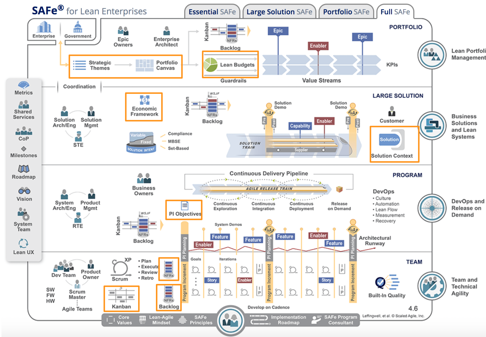
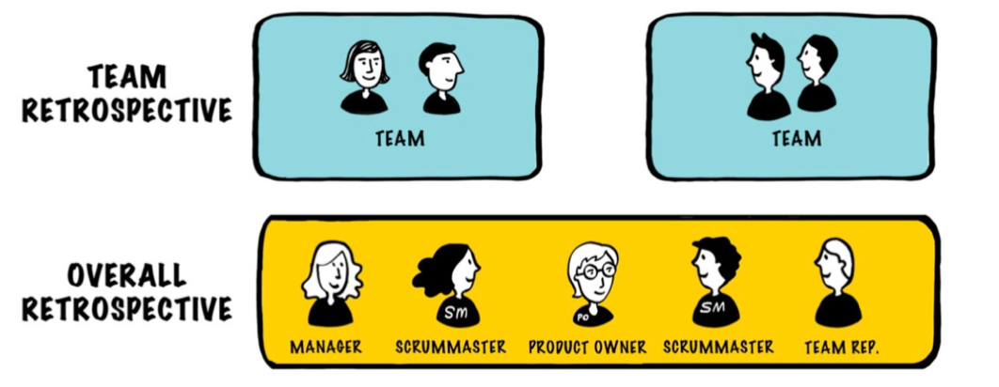
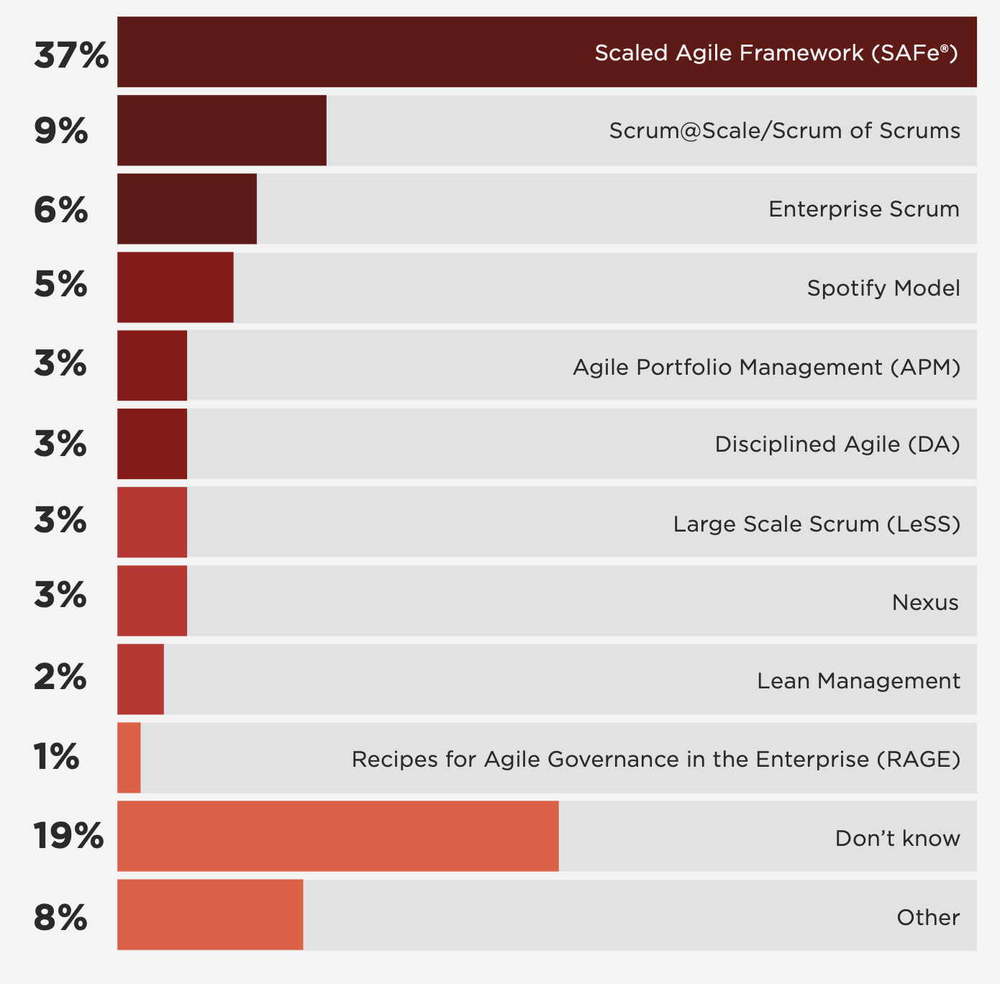

% Ohjelmistotuotanto
% Matti Luukkainen ja ohjaajat Kalle Ilves, Petri Suhonen, Oskari Nuottonen, Tuukka Puonti
% syksy 2022

#

&nbsp;&nbsp;&nbsp;&nbsp;&nbsp;&nbsp;&nbsp;&nbsp;&nbsp;&nbsp;&nbsp;&nbsp;&nbsp;&nbsp;&nbsp;&nbsp;&nbsp;&nbsp;&nbsp;&nbsp;&nbsp;&nbsp;&nbsp;&nbsp;&nbsp;&nbsp;&nbsp;&nbsp;&nbsp;&nbsp;&nbsp;&nbsp;&nbsp;&nbsp;&nbsp;&nbsp;&nbsp;Luento 10

&nbsp;&nbsp;&nbsp;&nbsp;&nbsp;&nbsp;&nbsp;&nbsp;&nbsp;&nbsp;&nbsp;&nbsp;&nbsp;&nbsp;&nbsp;&nbsp;&nbsp;&nbsp;&nbsp;&nbsp;&nbsp;&nbsp;&nbsp;&nbsp;&nbsp;&nbsp;&nbsp;&nbsp;&nbsp;&nbsp;&nbsp;&nbsp;&nbsp;&nbsp;&nbsp;&nbsp;29.11.2022

# Kurssipalaute

- Kurssipalaute
  - Kurssilla lopussa kerättävän palautteen lisäksi ns. jatkuva palaute https://coursefeedback.helsinki.fi
  - "jatkuvan palautteen" toiminnallisuus on vasta koekäytössä, ja sitä kehitetään mm. tämän kurssin kokemusten myötä

. . .

- Esim. laskareihin liittyviä asioita kannattaa kysyä pajassa/discordissa!

# Kurssin kaksi viimeistä viikkoa

- Miniprojektit jatkuvat
  - tällä ja ensiviikolla asiakastapaaminen

. . .

- Loppudemot (jokainen ryhmä osallistuu toiseen demoista)
  - ke 14.12. klo 12-14 B123
  - to 15.12. klo 14-17 A111
  - käy varaamassa aika!

. . .

- Vierailuluennot
  - ma 5.12. 12 Jami Kousa Unity, Mikko Tiainen Meru Health
  - ma 12.12. 12 Anniina Sallinen Oura
  - ti 13.12. 12 Hannu Kokko Elisa

. . .

- Koe tiistaina 20.12. klo 9-12 moodlessa

# Laajan mittakaavan ketterä

. . .

- Ketterä tarkoitettu alunperin pienten tiimien hallintaan
  - Scrum: 3-9 kehittäjää 
  - Entä jos on kyseessä massiivinen softa?

. . .

- Perusperiaate pitää **tiimit pieninä**, ja kasvattaa tuotantokapasiteettia käyttämällä **useampia tiimejä**
  - Tämä edellyttää, tiimien välistä töiden koordinointia 

. . .

- Jo kauan käytetty tapa: _Scrum of Scrums_ 
  - koordinoiva tiimi, johon kuuluu jäseniä jokaisesta Scrum-tiimistä
  - esim. scrum master tai lead developer osallistuu

. . .

- Scrum of Scrums -tiimi voi tavata päivittäin/viikoittain

# Scrum of Scrums 
 
- Scrum of Scrums -periaate on jo hyvin vanha
  - Jeff Sutherland  1996 

. . .

- Fimassa satoja sovelluskehittäjiä, kymmeniä Scrum-tiimejä ja useita eri tuotteita
  - Jokaisen tuotteen tiimejä kordinoi kerran viikossa kokoontuva Scrum of Scrums 

. . .

- Koko tuotejoukkoa hallinnoi kuukausittain kokoontuva "management Scrum"
  - koostui yrityksen johdosta, tuotepäälliköistä ja johtavista ohjelmistoarkkitehdeistä

. . .

- Kuvaus ei ole kovin seikkaperäinen
  - miten esim. backlogien suhteen tulisi toimia?

# Laajan mittakaavan ketterä

- Viimeisen kymmenen vuoden aikana ketterän skaalaamiseen esitelty useita menetelmiä, esim.
  - Scaled Agile Framework eli SAFe
  - Large Scale Scrum eli LeSS
  - Disiplined Agile eli DA
  - Enterprise Scrum
  - Nexus

. . .

- Laajentavat ketteryyttä ottamalla mukaan lean-ajattelua

. . .

- Toisin kuin ketterä, lean on lähtökohtaisesti tarkoitettu toimimaan suuressa skaalassa
  - sisältää enemmän koko organisaation toimintaa ohjaavia periaatteita kuin perinteinen ketterä

# Laajan mittakaavan ketterä

- Viimeisen kymmenen vuoden aikana ketterän skaalaamiseen esitelty useita menetelmiä, esim.
  - **Scaled Agile Framework eli SAFe**
  - **Large Scale Scrum eli LeSS**
  - Disiplined Agile eli DA
  - Enterprise Scrum
  - Nexus

- Laajentavat ketteryyttä ottamalla mukaan lean-ajattelua

- Toisin kuin ketterä, lean on lähtökohtaisesti tarkoitettu toimimaan suuressa skaalassa
  - sisältää enemmän koko organisaation toimintaa ohjaavia periaatteita kuin perinteinen ketterä

# SAFe eli Scaled Agile Framework

. . .

- Pääasiallinen kehittäjä on David Leffingwell joka toimi Nokia Mobile Phonesissa (NMP) konstulttina 2000-luvulla
  - SAFe on syntynyt pitkälti Nokialla tehdyn työn pohjalta
  - NMP:lla olikin käytössä eräänlainen esiversio SAFe:sta

. . .

- SAFe:n virallinen ensimmäinen version julkaistiin 2011

. . .

- Yhdistää _kaikki_ viime vuosien ketterän ja leanin parhaat käytänteet sekä joukon tuotteiden hallinnointiperiaatteita

. . .

- SAFe tarjoaa suuren määrän käytänteitä, henkilö- ja tiimirooleja sekä käsitteitä
  - _menetelmäkehys_, yritykset räätälöivät itselleen sopivanlaisen prosessin käyttäen SAFe:n tarjoamia työkaluja

. . .

- Tarojaa 4 erikokoista valmiiksi räätälöityä konfiguraatiota
  - _Essential SAFe:_ pienemmille yrityksille ja SAFen soveltamisen alkuvaiheeseen
  - _Full SAFe:_ massiivisten, useita eri tuotteita hallitsevan yrityksen käyttöön

#

{ width=450 }

#

{ width=450 }

# Release train ja product increment

- Sovelluskehityksen ytimessä modifioitu Scrum

. . .

- Samaa tuotetta tekevät tiimit muodostavat _release trainin_
  - tuottavat yhdessä isompia kokonaisuuksia useammasta sprintistä koostuvan _product increment_ -ajanjakson aikana

{ width=300 }

# SAFe

- Product incrementtejä ja niitä toteuttavia release traineja taas ohjaillaan yhä korkeammalta organisaatiosta erilaisten johtajien toimesta
  - SAFe tarjoaa tähän paljon tukea käsitteistön ja roolien kautta

. . .

- SAFe dokumentoitu laajasti ja tarjoaa tarkat ohjeet SAFen käyttöönottoon ja noudattamiseen

. . .

- SAFe firmojen johdon suosiossa
  - tarjoaakin firman managementille sopivasti tekemistä roolien ja käytänteiden muodossa

# paljon rooleja

{ width=450 }

# paljon artefakteja

{ width=450 }

# SAFe ja kritiikki

. . .

- SAFe sisältää käytännössä kaikki mahdolliset ketterän ja lean-ohjelmistokehityksen parhaat käytänteet
  - Kaikki vieläpä selkeästi ja yksityiskohtaisesti dokumenoituna

. . .

- agile/lean-kehityksen supermarket, kaikki on helposti saatavissa valmiina pakatussa mudossa
  - Pick and mix, avaa paketti ja seuraa ohjetta...

. . .

- SAFe käytetään paljon ja se on erityisen suosittu Suomessa

. . .

- SAFe on saanut osakseen myös paljon kritiikkiä
  - Osa kritiikistä kohdistuu SAFen määrittelemän prosessin raskauteen
  - Osa taas SAFe:n top down -management luonteeseen

. . .

- Ken Schwaber on kyseenalaistanut onko SAFe ylipäätään ketterä menetelmä 
  - _Individuals and Interactions Over Processes and Tools_
  - SAFe taas prosessina vaikuttaa kovin raskaalta

# LeSS eli Large Scale Scrum

. . .

- LeSS:in taustalla on Craig Larman ja Bas Vodde 
  - konsultteina 2000-luvun alussa Nokia Siemens Networksilla

. . .

- Erittäin yksinkertainen, vahvasti Scrumiin pohjautuva
  - Uusia rooleja, artifakteja ja palavereja ei ole 

. . .

- Kaksi eri versiota
  - _LeSS_ tilanteisiin, missä tuotetta tekee 2-8 scrum-tiimiä
  - _LeSS Huge_ tilanteisiin, missä tiimejä tarvitaan suurempi määrä

# LeSSin perusperiaatteet

- Sekä LeSS että LeSS Huge perustuvat seuraaviin

. . .

- Kehitetään yhtä tuotetta, jolla on yksi product owner ja yksi product backlog

. . .

- Kaikilla tiimeillä on samaan aikaan etenevät sprintit

. . .

- Tiimit tekevät sprintin aikana yhdessä tuotteesta uuden version
  - _one shippable product increment_

. . .

- Tiimit ovat
  - cross functional
  - cross component, full stack
  - feature teams

# LeSSin perusperiaatteet

- Jos yrityksellä on useita tuotteita, niitä kutakin varten on oma LeSS-toteutuksensa
  - LeSS ei ota kantaa siihen miten firma hallinnoi tuoteperheitään

. . .

- LeSS korostaa että kyse *ei ole* Scrumin päälle rakennettu erillinen kerros

. . .

- vaan ideana on sovelutaa Scrumin elementtejä laajemmassa skaalassa
  - LeSS is "barely sufficient methodology"

# More with less

- Periaatteet ovat lähes samat kuin SAFe:ssa, yksi periaatteista tekee kuitenkin selvää eroa menetelmien välille

. . .

- We don’t want 
  - **more roles** because more roles leads to less responsibility to teams
  - **more artifacts** because more artifacts leads to a greater distance between teams and customers
  - **more process** because that leads to less learning and team ownership of process

. . .

- Instead we want 
  - more **responsible teams** by having less roles
  - more **customer-focused teams** building useful products by having less artifacts
  - more **team ownership of process** and more meaningful work by having less defined processes

. . .

- We want more with less

# LeSS

- Katsotaan hieman tarkemmin LeSS:in pienempää konfiguraatiota

. . .

- Roolit
  - yksi product owner
  - 2-8 tiimiä
  - yksi scrum master 1-3 tiimiä kohti

. . .

- Tiimit:
  - cross functional
  - cross component / full stack
  - työskentelevät saman koodin parissa

#

- Artefaktit
  - yksi product backlog
  - yhteinen kehitettävä tuote (potentially shippable product increment)
  - tiimikohtaiset sprinttibacklogit

. . .

- Kaikille yhteinen sprintti

{ width=430 }

# LeSS: kaksiosainen sprintin suunnittelu

. . .

- Ensimmäisessä osassa product owner ja tiimien edustajat valitsevat backlogilta tiimeille seuraavan sprintin storyt

{ width=360 }

# LeSS: kaksiosainen sprintin suunnittelu 

- Ensimmäisessä osassa product owner ja tiimien edustajat valitsevat backlogilta tiimeille seuraavan sprintin storyt
- Toisessa osassa tiimit muodostavat omat sprint backlogit

{ width=360 }

#

- Kaikkien tiimien yhteinen aikaansaannos (one shippable product increment) katselmoidaan yhdessä

{ width=330 }

. . .

- Retrospektiivi on kaksitasoinen
  - tiimikohtainen 
  - overall-retrospektiivi: edustus kaikista tiimeistä ja mahdollisesti yrityksen johdosta

{ width=330 }

# LeSS: Muu tiimien välinen koordinointi

- Yhteisen sprintin suunnittelun, reviewin ja overall-retrospektiivin lisäksi ei edellytä muita yhteisiä tapaamisia

. . .

- LeSS antaa joukon aiheeseen liittyviä ohjeita ja suosituksia 

. . .

- Tiimit päättävät keskenään miten tiimien välinen koordinointi tapahtuu 
  - Emphasize Just Talk and informal networks 
  - communicate in code
  - cross-team meetings
  - component mentors
  - open spaces
  - scouts 

. . .

- Scrum of Scrums -palaverit mainitaan, mutta suositellaan informaalimpia kommunikaation muotoja

# LeSS huge

- Yksi tuote, backlog ja vastuunalainen product owner
- Backlog jaetaan _vaatimusalueisiin_ (requirement area)
  - jokaiselle alueelle siitä vastaava _area product owner_
  - muodostavat product owner -tiimi
  - backlogiin aluekohtaiset näkymät

{ width=440 }

# LeSS vs SAFe

- SAFen ja LeSSin juuret Suomessa ja Nokialla

. . .

- Nokian organisaatiorakenteen takia Nokia Mobile Phonesin (NMP) ja Nokia Siemens Networksin (NSN) ohjelmistokehitystapa oli täysin erilainen

. . .

- SAFe (NMP) ja LeSS (NSN) ovat samoista taustaperiaatteistaan ja yhteisestä syntykonsernista huolimatta hyvin erilaisia menetelmiä

. . .

- SAFe suosittu yritysjohdon keskuudessa, mutta saanut paljon kritiikkiä
  - Ohjelmistokehittäjiltä en ole kuullut SAFesta juurikaan kiitosta

. . .

- SAFe:n kotia Nokia Mobile Phonesia ei enää ole
- Nokia Networks taas on nykyinen Nokia ja soveltaa yhä LeSS-menetelmää

. . .

- SAFe:n asema vahva, ja vahvistuu koko ajan

# TAUKO 10 min

# Spotifyn skaalaamisen malli

. . .

- 2012 julkaistu artikkeli _Scaling agile @ Spotify_ saavutti paljon huomiota

- Miten Spotify skaalasi toimintansa muutamassa vuodessa yhdestä useampaan kymmeneen tiimiin

. . . 

{ width=350 }

# Squad eli tiimi

{ width=220 }

- Itseorganisoituva, cross-functional, featuretiimi
  - työskentelee yhdessä tilassa

. . .

- Saa itse päättää prosessinsa
  - ei välttämättä Scrum

. . .

- Tiimeillä vahva liiketoiminnallinen missio
  - suuri autonomia myös liiketoiminnallisiin päätöksiin
  - mahdollisimman suora asiakaskontakti
  - firman vision puitteissa

. . .

- Ministartup

. . .

- Agile coachit apuna

# 

- Tiimi vastaa usein suoraan asiakkaalle näkyvästä toiminnallisuudesta

{ width=350 }

- Tai muita tiimejä palvelevasta Spotifyn sisäisestä "palvelusta"

# Tribe eli heimo

{ width=280 }

- Joukko tiimejä jotka työskentelevät jonkin loogisen kokonaisuuden parissa

. . .

- Sijoitettu fyysisesti lähekkäin

. . .

- Yhteisiä kokousia: suunnittelua, demoja...

# Chapter eli jaos

- Riskinä että autonomiset tiimit joutuvat kohtaamaan toistuvasti samoja ongelmia

. . . 

{ width=300 }

- Heimon eri tiimien samaa asiaa tekevien ihmisten joukko
  - esim. testaajat, designerit, frontend-kehittäjät

- levittää tietoa tiimistä toiseen

# Guild eli kilta

{ width=350 }

- Yli heimorajojen ylittyvä samasta asiasta kiinnostuneiden yhteisö

# Spotifyn "malli"

- Kertoo siitä mikä tilanne Spotifyllä noin 2012-14

. . . 

- Dokumentoi ainoastaan pintapuolisesti tiettyjä asioita siitä miten firma oli organisoitunut
  - ei tarkoitettu ohjeeksi muille ...

. . . 

- Monet asiat ovat Spotifyllä sittemmin muuttuneet
  - "Spotify ei käytä Spotifyn mallia"

. . .

- Levisi yllättäen maailmalle
  - myös Suomessa ruvettiin pöhisemään heimoista

. . . 

- Saanut paljon kritiikkiä
  - "keksinyt" tunnettuja asioita uudelleen uusilla termeillä
  - Spotifyn sisältä (antaa utopistisen kuvan firman toiminnasta)
  - myös mallin soveltamista ilman sen hengen ymmärtämistä arvosteltu

# Miten laajalti ketterää/leania käytetään

. . .

- Paljon kyselytutkimuksia, luvut vaihtelevat 46-86 % välillä
  - Project management institute (2018): 46 % 
  - Stack owerflow (yli 200000 vastaajaa, 2018): 85.9%
  
. . .

- Akateemisia tutkimuksia:

. . .

- Oulun yliopisto _Survey on Agile and Lean usage in Finnish software industry_ 2012: 
  - 58% vastanneista 200 yrityksestä käytti agilea tai leania 

. . .

- Turun ylopisto ym _Adoption and Suitability of Software Development Methods and Practices_ 2016:
  - Scrum 71.2%
  - Kanban 49.5% 
  - Lean 39.7%
  - Vesiputous 35.3%

# 

- Helsingin yliopiston ja Nitorin loppuvuodesta 2018 tekemän selvitys

{ width=420 }

# 

- Yhdysvaltojen hallituksen alaiset ohjelmistoprojektit

{ width=420 }

# State of Agile -raportti: vuodesta 2005, uusin 2021

. . .

- Scrum dominoi 

{ width=400 }

#

- Projektinhallintakäytänteet

{ width=330 }

. . .

- short iterations 63%

#

- Tekniset käytänteet

{ width=420 }

# Laajan mittakaavan ketterä 

{ width=300 }

# DevOps

- onko tiheään julkaisuun yms pyrkivä DevOps-"kulttuuri" käytössä ja piedetäänkö sitä tärkeänä?

{ width=300 }

# Toimiiko ketterä ohjelmistokehitys

- Standish groupin _Chaos raport_, vuodesta 1995
  - Ohjelmistoprojektien onnistuminen

. . .

- 2018:

{ width=250 }

- successful: aikataulussa, budjetissa, sovittu toiminnallisuus

#

- Projektin koolla on todella suuri merkitys onnistumisen kannalta. 

{ width=280 }

#

- Ketteryydellä saavutettuja hyötyjä

{ width=350 }

# Toimiiko ketterä

- Evidenssiä on, mutta... 

. . .

- Kaikki edelliset olivat kyselytutkimuksia
  - käsitteitä ei ole kunnolla määritelty (Scrum vs Scrumbut)
  - osallistuneet eivät ehkä edusta tasaisesti koko populaatiota
  - kyselyjen tekijät eivät ole puolueettomia menetelmien suhteen

. . .

- Akateemisenkin tutkimuksen laatu ja tulosten yleistettävyys vaihtelee

. . .

- Ohjelmistokehityksessä liian paljon muuttujia, jotta jonkin yksittäisen tekijän vaikutusta voitaisiin mitata empiirisesti

. . .

- Menetelmiä soveltavat ihmiset, ja mittaustulos yhdellä tiimillä ei välttämättä yleisty muihin olosuhteisiin

# Ketterä post covid?

- eräs ketterän perusolettamuksia on se, että tiimi jakaa yhteisen työtilan
  - palataanko tähän koskaan?

. . .

{ width=350 }

. . .

- miten ohjelmistokehitys onnistunut etäaikana?

# Koe

- Koe tiistaina 20.12. klo 9-12 moodlessa

. . .

- Kaikki materiaali käytössä
  - copy paste tietysti kiellettyä
  - johtaa välittömään hylkäämiseen

. . .

- Koealueena kurssimateriaalin osat 1-5 sekä laskarit, paitsi
  - Git
  - poetry/Gradle 
  - GitHub Actions
  - unittest/JUnit
  - Mock/Mockito 
  - Robot/Cucumber/Selenium

. . .

- Vierailuluennot eivät kuulu koealueeseen

. . .

- Edellisten vuosien kokeita on nähtävillä vanhoilla kurssisivuilla
  - suureksi osaksi esseitä

#

#

# LeSS: Backlogin ylläpito

- LeSS kiinnittää eksplisiittisesti huomioita backlogin ylläpitämiseen

. . .

- Priorisoinnista vastaa Product Owner
  - Product Owner ei kuitenkaan tee yksin kaikkea backlog groomingia

. . .

- Kehitystiimien tulee olla mahdollisimman paljon interaktiossa suoraan loppukättäjien kanssa selvittäessään user storyjen vaatimaa toiminnallisuutta

. . .

- Kukin tiimi huolehtii niiden user storyjen groomaamisesta (storyjen pilkkominen ja tarkentaminen) jotka se todennäköisesti tulee toteuttamaan
  -  tarvittaessa tehdään useamman tiimin kesken tapahtuvaa groomausta, esim. toisiinsa liittyvien toiminnallisuuksien suhteeb

. . .

- LeSS siis rohkaisee voimakkaasti sovelluskehittäjien ja asiakkaiden/loppukäyttäjien läheiseen suoraan kanssakäymiseen
