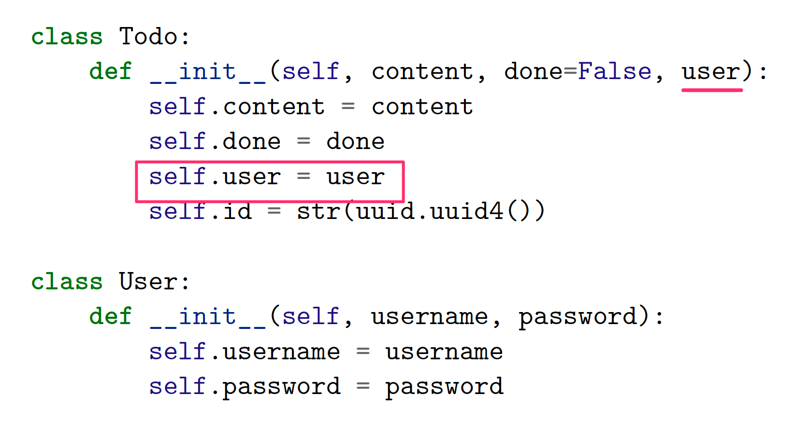

% Ohjelmistotuotanto
% Matti Luukkainen ja ohjaajat Kalle Ilves, Petri Suhonen, Oskari Nuottonen, Tuukka Puonti
% syksy 2022

# Vesiputousmalli

{ width=440 }

# Iteratiivinen ohjelmistokehitys

{ width=400 }

# Scrum

{ width=440 }

#

# Ohjelmistotekniikka

#

{ width=440 }

# Sekvenssikaavio

Mitä tapahtuu, kun maksukortilla jolla on rahaa 3 euroa, ostataan edullinen lounas?

```python
class Kassapaate:
    def __init__(self):
        self.EDULLISEN_HINTA = 2.5

    def syo_edullisesti(self, kortti: Maksukortti):
        if kortti.saldo < self.EDULLISEN_HINTA:
            return False

        kortti.ota_rahaa(self.EDULLISEN_HINTA):
        self.edulliset += 1
        return True
```
