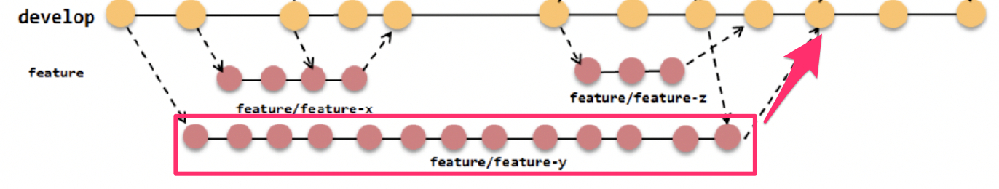

% Ohjelmistotuotanto
% Matti Luukkainen ja ohjaajat Kalle Ilves, Petri Suhonen, Oskari Nuottonen, Tuukka Puonti
% syksy 2022

# Vesiputousmalli

{ width=440 }

# luento 1

# Iteratiivinen ohjelmistokehitys

{ width=400 }

# luento 2

# Scrum

{ width=440 }

# luento 3

# Vaatimusmäärittely 2010-luvulla: Lean startup

{ width=200 }

# User story

- Mike Cohn:

  - _A user story describes functionality that will be valuable to either user or purchaser of software._

- User stories are composed of three aspects:
  1. A written description of the story, used for planning and reminder
  2. Conversations about the story to serve to flesh the details of the story
  3. Tests that convey and document details and that will be used to determine that the story is complete

# luento 4

#

{ width=350 }

# WIP-rajoitteet

{ width=300 }

#

{ width=450 }

# luento 5

#

- _Yksikkötestaus_ (unit testing)
- _Integraatiotestaus_ (integration testing)
- _Järjestelmätestaus_ (system testing)
- _Käyttäjän hyväksymistestaus_ (user acceptance testing)

{ width=300 }

# Ohtuvarasto: tyhjä, puolitäysi, täysi

```python
class Varasto
    def __init__(self, tilavuus, alku_saldo = 0):
        self.tilavuus = tilavuus
        self.saldo = alkusalto

    def ota_varastosta(self, maara):
        if maara < 0:
            return 0.0

        if maara > self.saldo:
            kaikki_mita_voidaan = self.saldo
            self.saldo = 0.0
            return kaikki_mita_voidaan

        self.saldo = self.saldo - maara
        return maara
```

# luento 6

# Test driven development (TDD)

{ width=340 }

# Riippuvuudet testeissä: dependency injection

{ width=400 }

# Mock-kirjastot

- Kaupan metodin _maksa_ pitää tehdä _tilisiirto_ kutsumalla _Pankin_ metodia

{ width=400 }

# Testit asiakkan kielellä

{ width=400 }

- _Input Credentials_, _Output should contain_ ym avainsanoja

#

{ width=400 }

#

{ width=400 }

# Luento 7

# Blue-green-deployment

{ width=400 }


- Uusi ominaisuus deployataan ensin passiiviseen ympäristöön
- ja sitä testataan
  - osa liikenteestä ohjataan aktiivisen lisäksi passiiviseen ympäristöön ja varmistetaan, että toiminta odotettua

# Canary release

- _Canary-releasessa_ uuden ominaisuuden sisältävään ympäristöön ohjataan osa järjestelmän käyttäjistä

{ width=400 }


- Uuden ominaisuuden sisältämää versiota _monitoroidaan_ 
  - jos ei ongelmia  ohjataan kaikki liikenne uuteen versioon

- Ongelmatilanteissa palautetaan käyttäjät aiempaan, toimivaksi todettuun versioon

# Feature branchit

- Uusi ominaisuus, esim. user story toteutetaan ensin omaan versionhallinnan haaraansa

{ width=400 }

  - ja ominaisuuden valmistuttua haara mergetään pääkehityshaaraan

# Trunk based development

- Uusi trendi _trunk based development_: pitkäikäisiä feature brancheja ei käytetä ollenkaan
  - Kaikki koodi suoraan pääkehityshaaraan
  - ... josta käytetään nimitystä _trunk_

{ width=400 }

# Yhteenveto - ketterän testauksen nelikettä

{ width=400 }

# luento 8

